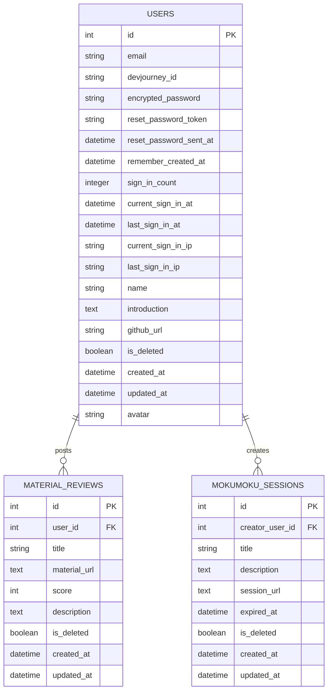

# README

# DevJourney


DevJourney はプログラミング教材のレビュー共有と、
オンラインもくもく会の企画・参加を手軽に行える学習支援サービスです。

ユーザーは、自分が実際に利用した教材を 5 段階評価でレビュー投稿できます。
他の学習者のレビューを一覧で確認したり、投稿に添付された教材の URL からすぐに教材の内容をチェックすることも可能です。

また、直近に企画されたオンラインもくもく会が一覧表示され、ワンクリックで参加できます。ユーザー自身がもくもく会を新規に作成して公開することも可能で、日本中のプログラミング学習者と気軽につながり、一緒に学習を進められる場を提供します。

---

## 開発背景

私自身も一人のプログラミング学習者として、一番大切なことは「学習を継続すること」 だと感じています。  
独学でプログラミングを始めたときは、「とにかくやってみよう」という気持ちで学習を始めました。しかし実際に取り組んでみると、初めて触れる考え方や理解に時間がかかる内容も多く、プログラミングの難しさを感じる場面が多くありました。  
そのような中で支えになったのが、同じくプログラミングを学習している同級生やインターンで出会った仲間の存在です。おすすめの教材などの情報を共有し合ったり、オンライン上で一緒に作業したりすることで、学習がより進めやすくなったと感じています。  
自身の経験を踏まえ、独学でプログラミングの学習に挑戦している人や、仲間を見つけたい人が少しでもスムーズに学習を続けられるようにしたいと思い、このサービスを開発しています。

---

## 主な機能

### 1. ログイン機能


•gemのdeviseを用いて、ユーザー情報の登録•編集、ユーザーのセッション管理を行っています。

---


•ログイン後はホーム画面に遷移。最新の教材レビューや開催中のもくもく会を確認することができ、ログインしていれば投稿•企画が可能です。

---

### 2. プロフィール編集機能


•プロフィールにはユーザーが登録した自己紹介やGitHubのURL、最近投稿したレビューが表示されます。編集にはgemのdevise機能を使用しており、表示する名前やアプリ上で使用するユーザー固有のID(DevJourney ID)を編集できます。アバター画像のアップロードにはgemのCarrierWave、画像処理にはMiniMagickを使用しています。

---

### 3. 教材レビューの投稿•閲覧機能


•使用したプログラミング教材のレビューを閲覧•投稿できる機能です。レビューは5段階で評価され、投稿には教材のソースURLを紐づけることができます。これにより、レビューの閲覧で気になった教材をすぐに確認することが可能です。また、ユーザーのアイコン•ID名をクリックすると、そのユーザーのプロフィール画面に飛ぶことができます。ログアウト状態ではレビューの投稿はできないように実装しています。

---

### 4. もくもく会の企画•参加機能


•リアルタイムですぐにもくもく会を企画•参加できる機能です。直近で開かれている様々なもくもく会を確認することができ、ログイン状態であれば添付されたミーティングURLからそのまま参加の申請、新しいもくもく会の企画が可能です。保守性を考慮し、ログアウト状態であれば企画•参加はできず、投稿から12時間が経過したもくもく会は非表示になるように実装しています。

---

### 5. スマホ画面への対応

<p align="center">
  
</p>

•スマホの画面サイズの場合は、サイドバーがヘッダーに置き換わるなどアプリのモバイル対応を考慮しています

---

## 使用技術

| 項目           | 内容                                      |
| -------------- | ----------------------------------------- |
| フロントエンド | Bootstrap5.3.8, React19.2.0(今後導入予定) |
| バックエンド   | Ruby3.4.7, Ruby on Rails8.0.3             |
| データベース   | PostgreSQL14.19                           |
| デザインツール | Figma                                     |
| 環境構築       | Docker                                    |
| CI•CD          | GitHub Actions                            |
| その他         | devise,CarrierWave,MiniMagick             |

### 技術スタックの選定理由

[フロントエンド]
Bootstrap はグリッドシステム(col-6 など)を使用することでモバイル画面に対応したレイアウトなどの UI の開発効率を向上できると考え、選定しました。また、React は豊富なライブラリと成熟したエコシステムを持ち、UI コンポーネントの作成・再利用が容易で高い保守性が期待できます。加えて、将来的に教材レビュー機能を手軽に見れるようなネイティブアプリとして提供したい構想があり、Web・モバイル双方に対応できる React(React Native)を導入予定です。

[バックエンド]
Web アプリケーションに必要な標準機能が揃っており、シンプルな文法によって長期的な保守性を維持しやすいと判断し、選定しました。また、Rails の「設定より規約」の思想や豊富なライブラリ（gem）により、開発効率を高めながら実装のばらつきを抑えられる点も採用理由としています。

[データベース]
堅牢性・信頼性が高くデータ破損や障害に強い点に加え、拡張システムなどによって幅広いユースケースに対応できることから、PostgreSQL を選定しました。

[Figma]
ブラウザ上で手軽に操作でき、環境構築なしでデザイン作業を進められる点に加え、Figma Make のプロンプト入力によってイメージを素早く UI 案やコードに落とし込めるため、デザインと実装の橋渡しが非常にスムーズになると判断し選定しました。

[環境構築]
自身のアプリをどんな方でも簡単に構築できる環境を整えたいと考え、現在実装に取り組んでいます。

[CI•CD]
GitHub Actions によるテスト等の自動化を行なっています。

[その他]
ログインやパスワードのハッシュ化など、ユーザー認証に必要な機能を提供してくれる devise を導入しています。また、アバター画像のアップロードや画像処理の実装において CarriwrWave と MiniMagick を導入しています。

---

## 工夫した点

### 1. セキュリティ面

```
(例: mokumoku_sessions_controller.rb)

class MokumokuSessionsController < ApplicationController
  def index
    # 未削除、期限有効なセッションのみ取得
    @mokumoku_sessions = MokumokuSession.valid
                                        .includes(:user)
                                        .where(users: { is_deleted: false })
                                        .order(created_at: :desc)
  end

  def new
    return render template: "errors/render_404", layout: false, status: :not_found unless user_signed_in?
    @mokumoku_session = MokumokuSession.new
  end

  def create
    return render template: "errors/render_404", layout: false, status: :not_found unless user_signed_in?

    @mokumoku_session = MokumokuSession.new(mokumoku_session_params)
    return render template: "errors/render_404", layout: false, status: :not_found unless @mokumoku_session.creator_user_id == current_user.id

    # 投稿から12時間経ったら投稿を非表示
    @mokumoku_session.expired_at = Time.zone.now + 12.hours

    if @mokumoku_session.save
      flash[:notice] = "もくもく会を作成しました！"
      redirect_to mokumoku_sessions_path
    else
      render :new, status: :unprocessable_entity
    end
  end

  private
    def mokumoku_session_params
      params.expect(mokumoku_session: [:creator_user_id, :title, :description, :session_url, :expired_at])
    end
end
```

•不正アクセスや情報漏洩を防ぐため、未認証アクセス時には 404 を返すよう設計しています。

---

```
(user.rbの一部抜粋)

def member_id
  # セキュリティ面を考慮し、user_idをランダム化して表示する
  (id * 413).to_s[1, 2] + ((17_674_114 + id) * 3).to_s + (id * 794).to_s[1, 2]
end
```

```
(application_helper.rbの一部抜粋)

def to_user_id(member_id)
  user_id = member_id[2..-3].to_i / 3 - 17_674_114
  member_id2 = (user_id * 413).to_s[1, 2] + ((17_674_114 + user_id) * 3).to_s + (user_id * 794).to_s[1, 2]
  if member_id == member_id2
    user_id
  else
    false
  end
end
```

```
class MemberController < ApplicationController
  include ApplicationHelper

  def profile
    member_id = params[:member_id]
    if member_id.to_s.match?(/\A\d+\z/)
      user_id = to_user_id(member_id)
      return render template: "errors/render_404", layout: false, status: :not_found if user_id == false

      @user = User.valid.find_by(id: user_id)
      return render template: "errors/render_404", layout: false, status: :not_found if @user.blank?

      @material_reviews = @user.material_reviews.valid
                                                .order(created_at: :desc)
    end
  end
end
```

•URL 上の識別子はランダム化することで安全性を考慮して実装を行っています。

### 2. レビュー投稿に教材 URL の紐付け

「このレビューされている教材、ちょっと気になる」というユーザーニーズに応えるため、レビュー投稿と教材 URL を紐付け、リンクからすぐに教材を確認できるようにしています。

### 3. もくもく会の即時性、表示期間の限定

「いますぐ誰かと一緒に勉強したい」というユーザーニーズに応えるため、認証済ユーザーは即時にもくもく会の参加や企画ができるように設計しました。また、古い投稿が残ることによる情報の陳腐化や、UI の煩雑化を避けるため、投稿から 12 時間以内のもくもく会のみを表示するようにしています。

### 4. ユーザーが使いやすい画面遷移•UI 設計

どのユーザーが利用してもアプリの使い方や機能の把握がしやすいよう、シンプルな画面遷移•UI 設計を心がけました。

---

## ER 図



### ユーザー情報に関するテーブル

ユーザー名・ユーザー ID(devjourney_id)・サインイン日時・アイコン画像などの情報を users テーブルで管理しています。

### 教材レビューの投稿に関するテーブル

レビュータイトル・教材 URL・5 段階評価・レビュー内容などの情報を material_reviews テーブルで管理しています。また、users テーブルと関連付けることで、レビュー投稿者のユーザー情報を取得できるようにしています。

### もくもく会の作成に関するテーブル

タイトル・内容・セッション URL・表示期限などの情報を mokumoku_sessions テーブルで管理しています。また、users テーブルと関連付けることで、もくもく会作成者のユーザー情報を取得できるようにしています。

---

## セットアップ（開発環境）

### Docker を使用する場合

1. リポジトリをクローン

```bash
git clone https://github.com/michaeljacksonreallylove/DevJourney.git
cd DevJourney
```

2. Docker イメージをビルドしてコンテナを起動

```bash
docker compose -f compose.yaml up --build
```

初回起動時は自動的に以下が実行されます：

- 依存関係のインストール（bundle install, yarn install）
- データベースの作成・マイグレーション

3. ブラウザでアクセス

http://localhost:3000

4. 停止する場合

```bash
docker compose -f compose.yaml down
```

※ `-v` オプションを付けるとデータベースのデータも削除されます

### Docker を使用しない場合

1. リポジトリをクローン

```bash
git clone https://github.com/michaeljacksonreallylove/DevJourney.git
cd DevJourney
```

2. 依存関係をインストール

```bash
bundle install
yarn install
```

3. データベース作成・マイグレート

```bash
bin/rails db:create db:migrate
```

4. サーバ起動

```bash
bin/dev
```

※ Docker を使用せずに画像処理（CarrierWave + MiniMagick 等）を使う場合、別途で`ImageMagick` のインストールが必要です（macOS では `brew install imagemagick`）

---

## 今後の展望・追加したい主な機能

### 1. もくもく会一覧の UI/UX 改善

•現在は、もくもく会一覧はすべてのデータを一括表示する形式です。表示速度や画面の重さなどの改善に向けて、必要なタイミングでデータを取得する非同期ロードへと切り替える予定です。

### 2. Open AI の API を用いて、入力したワードと関連のあるレビューを検索できる機能

•OpenAI の API を使って、入力したキーワードに関連するレビューを検索できる機能を追加します。たとえば『Ruby でおすすめの教材』のように入力すると、AI がデータベースの中から内容に合ったレビューを見つけて表示してくれる仕組みです。より探しやすく、欲しい情報にすぐアクセスできるようになります。

### 3. Zoom SDK(Meeting SDK)を用いて、アプリ自体に Zoom 機能を取り入れる

•Zoom の Meeting SDK を活用し、アプリ内から直接 Zoom ミーティングに参加できる機能を実装する予定です。これにより、もくもく会に参加する際に外部アプリへ移動する必要がなくなり、アプリ内でそのままビデオ通話や画面共有が利用できるようになります。参加ボタンを押すだけで Zoom が立ち上がるため、操作がシンプルになり、よりスムーズにもくもく会に参加できる体験を提供できる見込みです。また、参加人数の表示や参加中の UI などもアプリ内で完結させることで、より一体感のあるサービス体験の実現を目指します。

### 4. AWS に自身のサービスをデプロイする

•AWS にデプロイしてインフラをクラウド化し、安定性や運用しやすさの向上を目指します。
